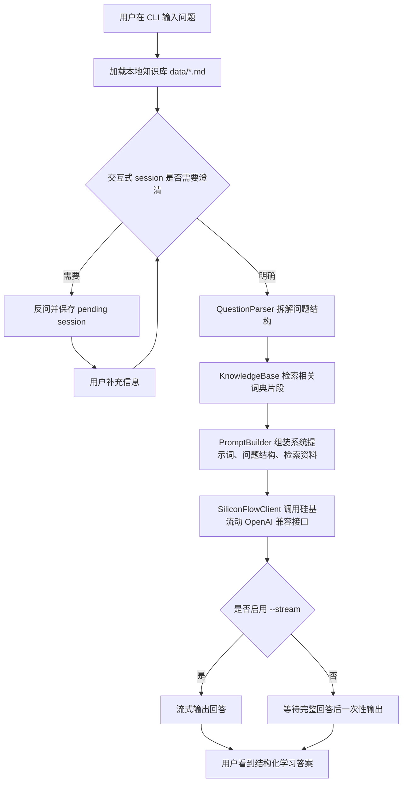

# 手势词典学习 Agent：从用户输入到回答的处理流程

本文档用于说明当前 `gesture_agent` 原型的工作链路，重点解释用户输入如何被拆解、如何检索 `data/` 中的手势词典内容，以及如何通过硅基流动 API 生成最终回答。

## 1. 当前目标

当前版本是“手势词典学习辅助 Agent”的第一阶段原型，目标不是做普通聊天，而是辅助用户按手势词典的结构学习交互设计知识。

已支持的十类问题：

1. 基础交互机制：例如“什么是单击？”
2. 高级交互机制：例如“快击如何解决单击和长按的冲突？”
3. 控件形态：例如“旋钮可以承载哪些属性？”
4. 基础属性：例如“二元属性的关键性质是什么？”
5. 多模态交互：例如“语音和手势如何分工？”
6. 语音交互：例如“语音交互需要怎样设计反馈闭环？”
7. 播客内容：例如“帮我写一期关于长按的播客脚本”
8. 交互机制对比：例如“单击和长按有什么区别？”
9. 背景知识：例如“交互的本质和操控力视角是什么？”
10. 理解交互案例：例如“分析一下手机图标长按进入编辑模式这个案例”

核心原则：

- 先理解问题结构，再调用模型回答。
- 回答必须使用手势词典的结构语言：控件形态、基本属性、交互机制、响应逻辑、交互特性、适用/不适用场景。
- 优先依据本地 `data/*.md` 中的词典资料，资料不足时要求模型明确说明。

## 2. 总体流程图



## 3. 模块职责

当前代码按职责拆成以下模块：

| 模块 | 文件 | 职责 |
| --- | --- | --- |
| CLI 入口 | `gesture_agent/cli.py` | 解析命令行参数，串联完整流程 |
| 数据模型 | `gesture_agent/core/models.py` | 定义 `SourceChunk`、`QuestionStructure` 等核心结构 |
| 文本工具 | `gesture_agent/core/text_utils.py` | 清洗文本、分词、标题归一化 |
| 知识库 | `gesture_agent/knowledge/base.py` | 读取 `data/*.md`，切分知识片段，检索相关内容 |
| 问题拆解 | `gesture_agent/learning/question_parser.py` | 判断问题意图、知识层级、关注点、输出框架 |
| 会话管理 | `gesture_agent/learning/session.py` | 管理模糊问题的反问、补充信息和 pending session |
| Prompt 构造 | `gesture_agent/learning/prompt_builder.py` | 把问题结构和检索资料组装成模型输入 |
| 模型调用 | `gesture_agent/providers/siliconflow.py` | 用 OpenAI 兼容 SDK 调用硅基流动 API |
| 图片处理 | `gesture_agent/media/images.py` | 将本地图片转为 data URL，用于多模态案例分析 |
| 配置读取 | `gesture_agent/settings/env.py` | 自动读取 `.env` 中的 API key、模型名、超时等配置 |

## 4. 详细处理链路

### 第 1 步：用户输入问题

用户通过命令行输入问题，例如：

```bash
UV_CACHE_DIR=/tmp/uv-cache uv run python -m gesture_agent.cli "什么是单击？" --stream --timeout 120 --max-tokens 1200 --top-k 3
```

CLI 会读取以下参数：

- `question`：用户问题。
- `--data-dir`：资料目录，默认是 `data`。
- `--top-k`：检索多少条资料片段，默认 6。
- `--stream`：是否流式输出。
- `--model`：指定硅基流动模型；不填则读取 `.env` 中的 `SILICONFLOW_MODEL`，传入 `--image` 时优先读取 `SILICONFLOW_VISION_MODEL`。
- `--timeout`：API 请求超时时间。
- `--max-tokens`：模型最大输出长度。

入口代码在 `gesture_agent/cli.py` 的 `main()` 和 `run_once()`。

### 第 2 步：加载本地手势词典资料

程序启动后会执行：

```python
kb = KnowledgeBase.load(args.data_dir)
```

当前默认读取：

- `data/1.md`
- `data/2.md`
- `data/3.md`
- `data/dic.md`

注意：当前还没有读取 `data/手势词典大纲定稿.xlsx`。

知识库加载过程：

1. 扫描 `data/*.md`。
2. 按标题规则切分成多个 `SourceChunk`。
3. 为每个片段记录标题、来源文件、起止行号、正文、知识层级、术语。
4. 建立术语列表，用于后续问题匹配和检索。

知识层级包括：

- `basic_property`：基本属性，如二元属性、位置属性、力属性。
- `interaction_mechanism`：交互机制，如单击、长按、拖拽、甩动。
- `control_form`：控件形态，如按钮、旋钮、触控面、手势。
- `interaction_case`：交互案例。
- `unknown`：暂未识别的章节。

### 第 3 步：拆解用户问题结构

在交互式模式下，系统会先经过 `ConversationSession` 判断问题是否足够明确：

1. 如果 intent 明确，例如“什么是单击？”，直接进入问题结构拆解。
2. 如果问题模糊，例如“这个怎么用？”，系统会先反问。
3. 用户补充信息会被保存到 pending session 中，并与原始问题合并。
4. 合并后再次判断 intent；如果仍不明确，继续反问。
5. intent 明确后，清空 pending session，并进入检索和回答流程。
6. 回答成功后，`ConversationSession.record_turn()` 会记录本轮的用户问题、resolved query、intent、命中术语、output frame 和回答摘要。
7. 下一轮如果出现“它、这个、继续、区别、相比”等追问信号，session 会把短期对话记忆拼入 resolved query，重新判断 intent 并重新检索。

如果命令启用 `--llm-intent`，判断链路会变成：

1. `QuestionParser.resolve_intent()` 先用本地规则给出候选 intent、置信度、缺失信息和澄清问题。
2. `LLMIntentResolver` 把“当前输入 + 对话记忆 + 规则候选”交给硅基流动模型，要求只返回结构化 JSON。
3. 如果大模型给出合法 intent 且不需要澄清，session 使用该 intent 调用 `QuestionParser.parse(..., forced_intent=...)`。
4. 如果大模型返回不合法 JSON、API 失败或没有合法 intent，系统回退到本地规则；如果仍不明确，继续反问。

示例：

```text
用户：这个怎么用？
Agent：需要澄清：这个问题目前无法确定要按哪类任务处理。你是想问基础交互机制、控件形态、基础属性、交互机制对比、背景知识、案例分析，还是播客/语音/多模态内容？
用户：我想问单击这个基础交互机制
Agent：确定 intent=basic_interaction_mechanism，继续检索并回答。
```

追问示例：

```text
用户：什么是单击？
Agent：按“基础交互机制”回答，并记录 terms=单击。
用户：那它和长按有什么区别？
Agent：结合记忆把“它”补全为“单击”，重新判断 intent=interaction_compare，检索单击、长按和快击相关资料后回答。
```

问题会交给 `QuestionParser.parse()`，输出一个 `QuestionStructure`。

示例：用户问“什么是单击？”

```json
{
  "raw_query": "什么是单击？",
  "intent": "basic_interaction_mechanism",
  "layers": ["interaction_mechanism"],
  "terms": ["单击"],
  "focus": ["定义", "逻辑关系", "适用边界"],
  "compare_targets": [],
  "case_modality": ["text"],
  "missing_info": [],
  "output_frame": ["核心定义", "基础属性", "状态/变化序列", "响应逻辑", "适用与不适用", "关联机制"]
}
```

这里的关键字段：

- `intent`：判断用户要做什么。
- `layers`：判断问题涉及哪个知识层级。
- `terms`：从词典中命中的术语。
- `focus`：判断用户关注定义、属性、逻辑、场景还是案例。
- `output_frame`：规定模型回答时必须遵守的结构。

十类意图对应的输出框架：

| 意图 | 触发类型 | 输出框架 |
| --- | --- | --- |
| `basic_interaction_mechanism` | 基础机制术语，如单击、长按、拖拽 | 核心定义、基础属性、状态/变化序列、响应逻辑、适用与不适用、关联机制 |
| `advanced_interaction_mechanism` | 高级、组合、冲突调和机制，如快击、点拖互斥 | 要解决的问题、构成机制、判定条件、响应逻辑、设计收益与代价、关联基础机制 |
| `control_form` | 控件形态，如按钮、旋钮、触控面、手势 | 控件定义、可用属性、可承载的交互机制、典型案例、设计注意点 |
| `basic_property` | 基础属性，如二元属性、位置属性、力属性 | 核心含义、连续性/维度/感知灵敏度、相关案例、适用与不适用、可组合方向 |
| `multimodal_interaction` | 多模态、跨模态、语音与手势分工 | 模态组成、信息分工、融合/切换逻辑、适用场景、风险与校准、案例或启发 |
| `voice_interaction` | 语音交互、声控、口令、唤醒词 | 输入内容与声学属性、识别/触发逻辑、反馈闭环、适用场景、限制与替代入口 |
| `podcast_content` | 播客、口播、脚本、讲稿 | 主题定位、听众对象、内容大纲、关键讲述点、示例口播、延伸问题 |
| `interaction_compare` | 对比/区别/差异/vs | 对比对象、共同基础、核心差异、适用边界、选择建议 |
| `background_knowledge` | 背景、交互本质、操控力、IxDL、声明式 | 背景问题、核心观点、词典中的位置、为什么重要、与后续知识的关系 |
| `case_analysis` | 案例/图片/图中/分析/拆解 | 案例描述、控件形态、基础属性、交互机制、响应逻辑、设计判断、追问 |

### 第 4 步：检索相关词典片段

问题结构得到后，系统会执行：

```python
chunks = kb.search(question, top_k=args.top_k, prefer_terms=structure.terms)
```

检索逻辑不是向量检索，而是当前第一版的轻量本地检索：

1. 如果问题命中词典术语，例如“单击”，优先匹配标题和正文。
2. 对问题和资料标题/正文做轻量分词。
3. 标题命中权重大于正文命中。
4. `interaction_mechanism` 会略微加权，因为当前核心学习内容主要是交互机制。
5. 对结果去重，保留排名最高的 `top-k` 条。

示例：用户问“什么是单击？”时，`--dry-run` 会检索到类似：

```text
1. 1-b 单击(010变化) (data/2.md:43-66)
2. 4-a 快击(单击vs长按) (data/2.md:760-784)
3. 4-b 点击缓冲 (单击vs双击) (data/2.md:785-809)
```

这些片段会成为模型回答的依据。

### 第 5 步：组装 Prompt

`PromptBuilder` 会把三类信息组合成模型输入：

1. 系统提示词：规定 Agent 身份、回答原则和约束。
2. 问题结构：把 `QuestionStructure` 以 JSON 形式放入 prompt。
3. 检索资料：把 `SourceChunk` 的标题、来源、层级、匹配分、正文放入 prompt。

系统提示词核心要求：

- 先按“问题结构”理解用户意图。
- 只依据给定词典资料回答。
- 优先使用词典结构语言。
- 面向学习，不只给结论，还要指出下一步观察或追问什么。
- 回答准确、结构化、简洁。

模型最终看到的用户 prompt 结构大致是：

```text
用户原问题：
什么是单击？

问题结构：
{...QuestionStructure JSON...}

词典检索资料：
[1] 1-b 单击(010变化)
来源：data/2.md:43-66；层级：interaction_mechanism；匹配分：...
...

请按问题结构中的 output_frame 回答。
```

### 第 6 步：调用硅基流动 API

模型调用由 `gesture_agent/providers/siliconflow.py` 完成。

当前使用 OpenAI 兼容 SDK：

```python
from openai import OpenAI

client = OpenAI(
    api_key=...,
    base_url="https://api.siliconflow.cn/v1",
    timeout=...,
    max_retries=...
)
```

实际调用：

```python
client.chat.completions.create(
    model=...,
    messages=messages,
    temperature=...,
    top_p=...,
    max_tokens=...,
    stream=True or False
)
```

配置从 `.env` 自动读取：

```bash
SILICONFLOW_API_KEY=...
SILICONFLOW_MODEL=zai-org/GLM-4.6
SILICONFLOW_VISION_MODEL=
SILICONFLOW_BASE_URL=https://api.siliconflow.cn/v1
SILICONFLOW_TIMEOUT=60
SILICONFLOW_MAX_RETRIES=0
```

模型选择优先级：

1. 命令行显式传入 `--model` 时，始终使用该模型。
2. 传入 `--image` 且没有 `--model` 时，使用 `SILICONFLOW_VISION_MODEL`。
3. 没有图片或未配置视觉模型时，使用 `SILICONFLOW_MODEL`。

### 第 7 步：输出回答

有两种输出模式。

非流式模式：

- 等模型完整返回后一次性打印。
- 如果模型较慢，终端会等待较久。
- 如果超时，会提示 `request timed out`。

流式模式：

- 使用 `--stream`。
- 模型生成一点就输出一点。
- 更适合长回答和推理模型。
- 如果达到 `--max-tokens` 上限，会提示回答被截断。

推荐演示命令：

```bash
UV_CACHE_DIR=/tmp/uv-cache uv run python -m gesture_agent.cli "什么是单击？" --stream --timeout 120 --max-tokens 1200 --top-k 3
```

## 5. `--dry-run` 如何用于调试

`--dry-run` 不调用模型，只展示本地问题拆解和资料检索结果。

示例：

```bash
UV_CACHE_DIR=/tmp/uv-cache uv run python -m gesture_agent.cli "单击和长按有什么区别？" --dry-run
```

用途：

- 验证 `data/` 是否被读取。
- 验证问题意图是否识别正确。
- 验证检索是否命中正确章节。
- 在没有 API key 或网络不稳定时，仍可检查本地流程。

## 6. 当前能力边界

当前版本已经完成：

- 自动读取 `.env`。
- 读取 `data/*.md` 并拆分为知识片段。
- 识别十类用户意图，并为每类分配独立 `output_frame`。
- 在交互式模式下管理 session：模糊问题会先反问，补充信息进入 pending session，直到 intent 明确后再回答。
- 记录短期对话记忆：回答成功后保存前几轮问题结构和回答摘要，支持“它/这个/继续/区别”等追问。
- 可选使用 `--llm-intent`：用硅基流动模型结合规则候选和对话记忆辅助判断 intent，失败时回退到本地规则。
- 基于术语和文本匹配进行本地检索。
- 将问题结构、短期对话记忆和检索资料注入 prompt。
- 通过硅基流动 OpenAI 兼容接口生成回答。
- 支持流式输出、API 连通性检查、超时和截断提示。

当前限制：

- 还没有使用向量数据库，检索是关键词和轻量分词匹配。
- 还没有读取 Excel 大纲文件。
- 图片案例只完成接口预留，实际效果取决于所选模型是否支持视觉输入。
- LLM intent 判断是可选能力；不加 `--llm-intent` 时仍使用本地规则。
- 当前只有短期会话记忆，没有跨进程/跨天的长期记忆。

## 7. 下一步可汇报的优化方向

建议按优先级推进：

1. 引入结构化索引：把属性、机制、控件形态拆成稳定 JSON，减少对 Markdown 标题规则的依赖。
2. 引入向量检索：解决同义表达和案例描述不直接命中术语的问题。
3. 建立案例分析模板：要求用户补充“控件、动作、反馈、场景、目标任务”，提升案例拆解质量。
4. 增加学习路径模式：根据用户掌握程度从属性、机制、控件形态逐层引导。
5. 增加引用展示：最终回答中明确标注来自 `data/2.md:43-66` 等来源，便于教学核查。
6. 增加 Web UI：将 `--dry-run`、检索资料、最终回答分区展示，更适合教学演示。

## 8. 一句话总结

当前 Agent 的核心链路是：用户输入问题后，系统先用本地手势词典资料拆解问题结构并检索相关知识片段，再把“问题结构 + 词典上下文”交给硅基流动模型生成结构化学习答案。
