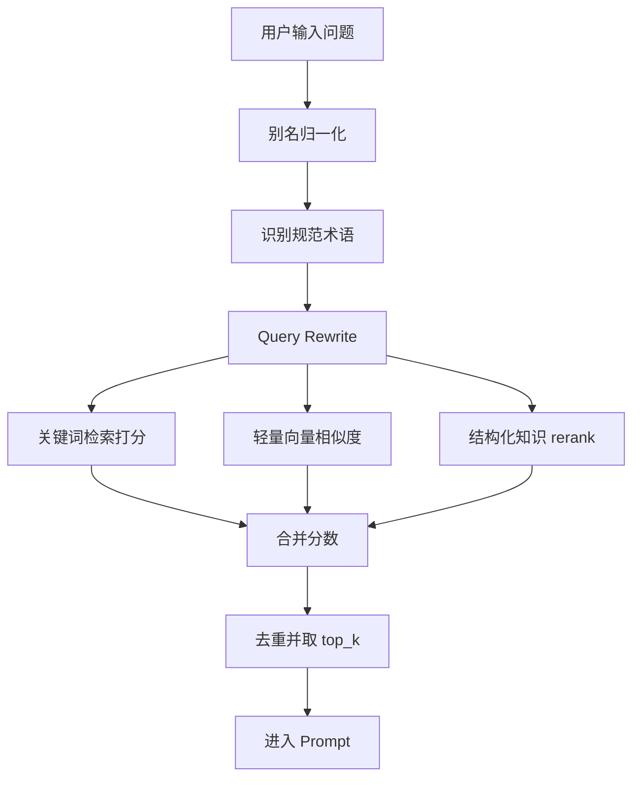

# 检索能力升级汇报：别名映射、结构化知识库与混合检索

本文档总结本次对 `gesture_agent` 的检索和知识库能力升级，方便向导师说明“为什么要改、改了什么、现在如何工作、后续还能怎么优化”。

## 1. 更新目标

此前 Agent 的检索主要依赖 Markdown 标题切块和关键词匹配。它能回答“什么是单击？”这类术语明确的问题，但在以下情况中不够稳定：

- 用户使用口语说法，例如“点一下”“按住”“拖动”，不一定直接命中词典里的“单击”“长按”“拖拽”。
- 用户问题没有直接出现词典标题，但语义上相关，例如问“音量旋钮拖动调节是否合理”，需要同时检索控件形态、基础属性、交互机制和响应逻辑。
- 资料逐渐增多后，仅靠标题/正文关键词排序，容易把相关但不关键的片段排到前面。

本次升级的目标是让 Agent 在进入大模型回答前，先把用户问题转成更接近“手势词典结构”的检索请求，并用结构化知识增强排序。

## 2. 本次实现的三项能力

### 2.1 术语别名映射

新增 `aliases` 机制，把用户自然语言中的口语或英文说法映射到规范术语。

示例：

```json
{
  "aliases": {
    "点一下": "单击",
    "按住": "长按",
    "拖动": "拖拽",
    "knob": "旋钮",
    "slider": "滑块"
  }
}
```

运行时效果：

```text
用户：点一下和按住有什么区别？
系统识别：单击、长按
```

这样可以避免模型在回答中沿用混乱术语，也能提升检索命中率。

### 2.2 Query Rewrite

在检索前，系统会先做查询改写：

1. 对用户问题做别名归一化。
2. 找出命中的规范术语。
3. 从结构化知识库中读取这些术语的类型、属性、机制、控件形态、响应逻辑和关联术语。
4. 把这些内容追加到检索 query 中。

示例：

```text
原始问题：
点一下是什么？

归一化：
单击是什么？

扩展后的检索信息：
单击、基础交互机制、相关属性、相关机制、响应逻辑、关联术语
```

这一步的作用是让检索不只看用户原话，而是看“用户原话 + 手势词典结构化上下文”。

### 2.3 结构化知识库 JSON

新增结构化知识条目 `StructuredKnowledgeItem`，用于把 Markdown 切块后的知识进一步组织成稳定字段。

核心字段包括：

```json
{
  "term": "单击",
  "term_type": "基础交互机制",
  "layer": "interaction_mechanism",
  "definition": "...",
  "aliases": ["点一下"],
  "properties": ["时间属性"],
  "mechanisms": ["快击", "点击缓冲"],
  "control_forms": ["触控面"],
  "response_logic": "...",
  "related_terms": ["长按", "双击"],
  "source": "data/2.md:43-66"
}
```

结构化知识库有两种来源：

- 自动从现有 Markdown 资料生成。
- 导出为 JSON 后由人工编辑。

导出命令：

```bash
uv run python -m gesture_agent.cli --export-structured-knowledge data/structured_knowledge.json
```

默认配置位置：

```jsonc
"data": {
  "structured_knowledge": "data/structured_knowledge.json"
}
```

### 2.4 混合检索与 rerank

检索排序现在由三部分组成：

1. 关键词打分：保留原来的标题命中、正文命中、token 重合等规则。
2. 轻量向量相似度：不引入外部依赖，用 token set Jaccard 相似度近似语义相似度。
3. 结构化 rerank：如果资料片段对应的结构化知识条目命中了当前术语、属性、机制、控件形态或关联术语，会额外加权。

这不是外部向量数据库方案，而是一个本地可控的混合检索原型。优点是部署简单、可解释、适合当前资料规模。

## 3. 当前检索流程



简化理解：

```text
用户自然语言
-> 规范术语
-> 结构化词典查询
-> 混合检索排序
-> 结构化回答
```

## 4. 文件变化

主要代码：

- `gesture_agent/knowledge/base.py`：新增别名映射、Query Rewrite、结构化知识库加载/导出、混合检索和 rerank。
- `gesture_agent/core/models.py`：新增 `StructuredKnowledgeItem`，扩展 `TermInventory.aliases`。
- `gesture_agent/cli.py`：新增 `--structured-knowledge` 和 `--export-structured-knowledge`。
- `gesture_agent/settings/app_config.py`：新增 `data.structured_knowledge` 配置项。
- `gesture_agent/learning/question_parser.py`：调整 intent 判断，避免 Query Rewrite 后属性问题被误判成机制问题。

配置和数据：

- `data/term_inventory.example.json`：新增 `aliases` 示例。
- `data/structured_knowledge.example.json`：新增结构化知识库模板。
- `agent_config.example.json`：新增 `structured_knowledge` 配置项。

测试：

- `tests/test_knowledge_base.py`：覆盖别名映射、Query Rewrite、结构化知识库导入、混合检索和导出。
- `tests/test_config.py`：覆盖结构化知识库配置读取。

## 5. 示例验证

测试命令：

```bash
uv run python -m gesture_agent.cli "点一下和按住有什么区别？" --dry-run --top-k 5
```

预期效果：

- `terms` 识别为 `单击`、`长按`。
- `intent` 识别为 `interaction_compare`。
- 检索结果优先包含 `单击`、`长按`、相关冲突调和机制和对比资料。

本次完整测试结果：

```text
53 passed
```

编译检查：

```text
compileall gesture_agent 通过
```

## 6. 对 Agent 性能的影响

### 6.1 回答质量

别名映射减少了术语混乱。用户说“点一下”，系统内部会按“单击”处理，最终回答更容易保持手势词典的规范语言。

### 6.2 检索准确率

Query Rewrite 和结构化 rerank 让检索不只依赖原始问题文字，而是能根据词典结构补充相关字段。比如一个设计评估问题可以同时关联到控件形态、基础属性、交互机制和响应逻辑。

### 6.3 可维护性

结构化知识库导出后可以由人工校对。后续专家不需要直接改代码，可以通过 JSON 文件补充：

- 术语定义
- 别名
- 属性
- 关联机制
- 控件形态
- 响应逻辑
- 关联术语

## 7. 当前边界

- 轻量向量相似度仍是本地 token set 算法，不是真正的 embedding 向量数据库。
- 结构化知识库当前主要从 Markdown 自动生成，字段质量依赖原始资料结构；最好后续由专家人工校对。
- Query Rewrite 是规则驱动，没有调用大模型改写，因此稳定可控，但同义泛化能力有限。
- rerank 是启发式加权，后续可以用人工标注样本优化权重。

## 8. 后续建议

下一步可以做三件事：

1. 人工校对 `data/structured_knowledge.json`，先把高频术语如单击、长按、拖拽、旋钮、按钮、微变标完整。
2. 建立检索评测集，例如 30 个典型问题，每个问题标注应该命中的资料片段。
3. 如果资料规模继续扩大，再引入真正的 embedding 向量库和 reranker 模型。

## 9. 一句话总结

这次升级把 Agent 的检索从“关键词匹配 Markdown 片段”推进到“别名归一化 + 结构化知识扩展 + 混合检索 rerank”，使它更能按照手势词典的术语体系理解用户问题，并把更相关的资料交给大模型回答。
